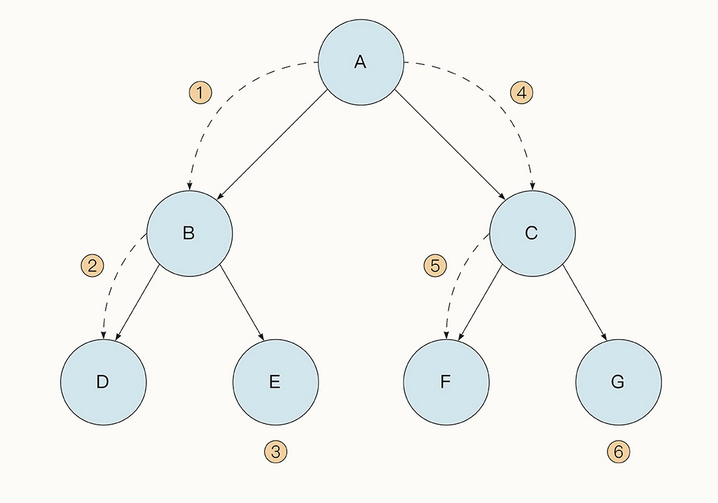
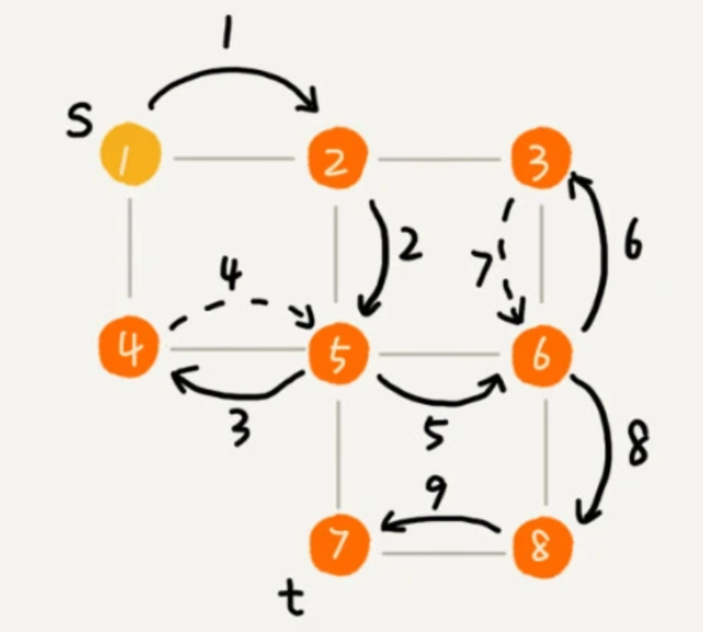

## 深度优先搜索算法 （Depth-First-Search，DFS）
### 简介
1. 深度优先搜索的特点就是“顺藤摸瓜”，一路向下，先找最“深”的节点。
2. 深度优先搜索可以采取递归与非递归两种形式。
3. 无论递归还是非递归，最终都是要利用栈的思想来实现度优先搜索
### 实现形式
1. 递归：函数调用时不断压栈，可能导致栈内存超出限制，这对于 Go 语言来说会有栈扩容的成本，并且在实践中也不太好调试。
2. 非递归：非递归形式要更简单一些，我们可以借助堆栈先入后出的特性来实现它，不过需要开辟额外的空间来模拟堆栈。
### 树形式

### 图形式
