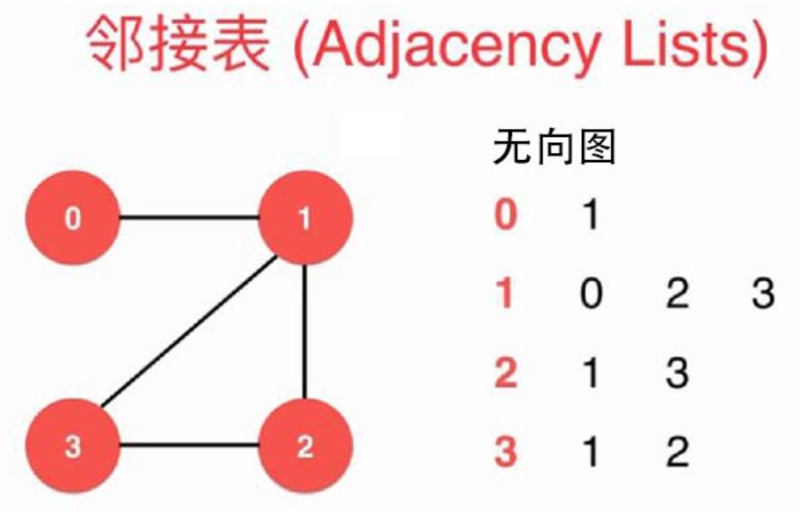
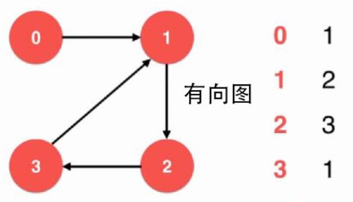
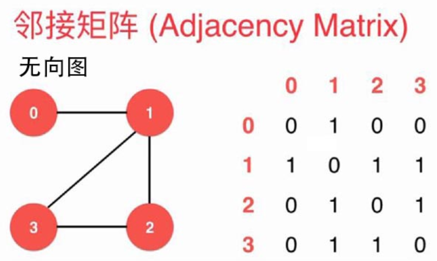
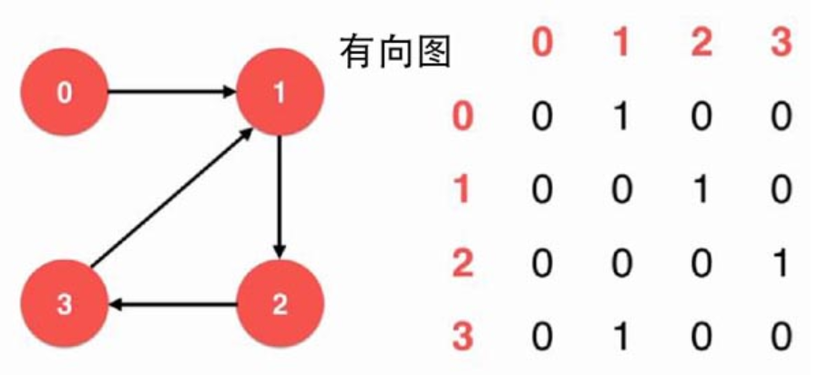
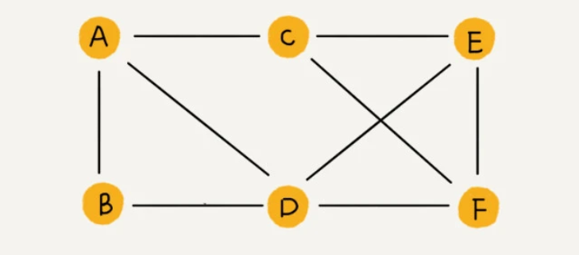
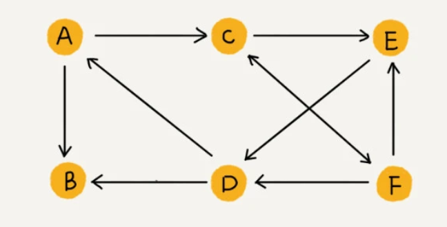
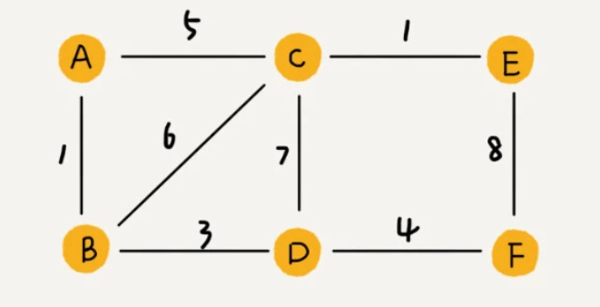

##特性
1. 顶点：图中的元素我们就叫做顶点（vertex）。
2. 边：图中的一个顶点可以与任意其他顶点建立连接关系。我们把这种建立的关系叫做边（edge）。
3. 顶点的度（degree）：就是跟顶点相连接的边的条数。
4. 带权图（weighted graph）。在带权图中，每条边都有一个权重（weight）。
5. 无向图中有“度”这个概念，表示一个顶点有多少条边。在有向图中，我们把度分为入度（In-degree）和出度（Out-degree）

##存储方式
###邻接表

###邻接矩阵

##适用场景
###社交网络-微信（无向图）

1. 把每个用户看作一个顶点。如果两个用户之间互加好友，那就在两者之间建立一条边
2. 个用户有多少个好友，对应到图中，就叫做顶点的度（degree），就是跟顶点相连接的边的条数。
###社交网络-微博（有向图）

1. 微博允许单向关注，也就是说，用户 A 关注了用户 B，但用户 B 可以不关注用户 A
###社交网路-QQ（带权图）

1. 权重来表示 QQ 好友间的亲密度。

####注意
png图中展示的图的索引1,2,3,4，是不固定的，自行定义，然后存储的稀疏矩阵的值就相应变化。