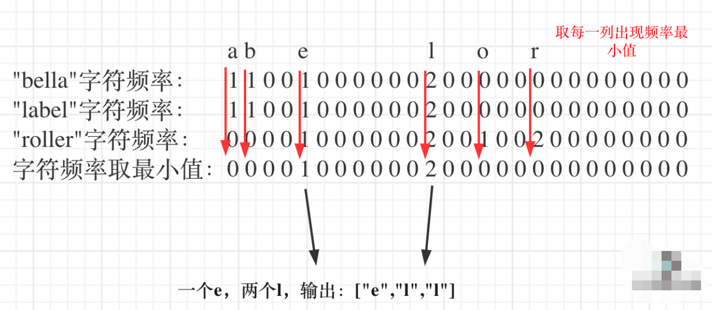

##简介
散列表（Hash table，也叫哈希表），是根据关键码值 (Key value)而直接进行访问的数据结构。

也就是说，它通过把关键码值映射到表中一个位置来访问记录，以加快查找的速度。这个映射函数叫做散列函数，存放记录的数组叫做散列表。

##重要注册部分
1. key
2. hash function : 把 key 转化为 table 的下标，把数据存放于此
3. table : 一个数组，存放数据

##解决冲突
###开放寻址法
1. 当哈希函数计算得到的下标值，在数组中存放有值时，就继续往后遍历数组，找到空的位置把数组存放于此。
2. 删除数据时，除了把数据删除，还会加上 deleted 标记
3. 用装载因子表示散列表中的空位，装载因子 = 填入表中的元素个数 / 散列表的长度
4. 适合数据量较小，装载因子小的散列表。
###链表法
1. 在散列表中的每个桶（bucket）或槽（slot）对应一条链表，散列值相同的元素都放在同等槽位的链表上。
2. 适合存储大对象、大数据的散列表。

##动态扩容-一次性扩容
阈值动态因子大小为0.75，一般申请两倍大小的数组，然后把原来的散列表搬迁过来
1. 缺陷：通常插入数据很快，但如果有个别插入很慢，会让用户崩溃
2. 解决方案：分批插入，当有新数据插入时，顺便从老数组拿数据插入。查询时先从新数组查，再到老数组查。

##散列函数
只要生成的哈希值能够简单高效、分布均匀就ok。

问题：
1. 查找常用字符串

