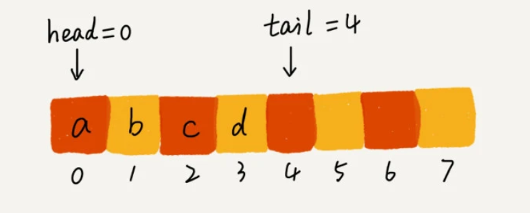

##特性
1. 一种操作受限的线性表数据结构，一头出数据，一头入数据。
2. 特点是先进先出。
3. 基本操作是：加入一个元素到尾部，在头部取出一个数据。

##分类
###顺序队列和链式队列
1. 顺序队列：由数组实现，链式队列：由链表实现。
2. 队列一般有两个指针，一个head指向队头，一个tail指向队尾。
3. 顺序队列在入队与出队操作过程中，会产生一个空闲空间，而且此空间无法再往队列中添加元素。解决方案是：
在入队列的过程中多一个数据迁移的步骤，如果存在空闲空间且无法入队列，就进行数据迁移。
4. 链式队列的实现，同样存在head指针跟tail指针。入队时，执行的操作是：tail -> next = new_node,
tail = tail -> next,出队时，head = head -> next.
###循环队列
1. 一种环状的队列，原本数组是有头有尾的，一条直线，把首尾相连就形成了一个环。
2. 出队列头指针的计算公式是 (head + 1) % size
3. 入队列尾指针的计算公式是 (tail + 1) % size
4. 写好循环队列的实现代码，需要确定两个条件：（1）队列为空的判断条件是head == tail.
(2)队列为满的条件是 (tail + 1) % size == head.
###阻塞队列和并发队列
1. 阻塞队列：
1)在队列的基础上增加阻塞操作。
2)当队列为空时，取数据将会阻塞，因为没有数据可以取，直到里面有数据才可以返回。当队列为满时，插入数据
将会阻塞，直到有空闲位置再插入数据，然后再返回。
3)由阻塞队列可以实现“生产者与消费者模型”，可以有效地协调生产与消费的速度。

2. 并发队列：
1）线程安全的队列，就叫并发安全队列。
2）简单直接的实现方式是：在enqueue()、dequeue()方法上加锁，但是锁粒度太大的话会导致并发度比较低，
同一时刻仅允许一个存或者取操作。
3）基于数据的循环队列，利用CAS原子操作，也可以实现非常高效的并发队列，这也是比链式队列运用广的原因。

##问题：线程池没有空闲线程时，新的任务请求线程资源时，线程池如何处理？各种处理策略优势如何实现的
1. 非阻塞模式：直接拒绝请求线程。
2. 阻塞模式：请求排队等待。
1）基于链表的实现方式：可以无限排队，但会导致过多的排队等待，请求响应的时间长。对于对响应时间比较敏感的
系统，这种方式是不合理的。
2）基于数组的实现方式：排队的请求有限，超过界限就会拒绝响应。这对于对响应时间比较敏感的系统是
比较友好的。