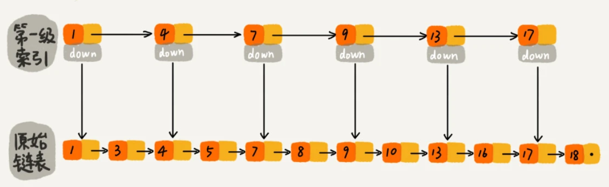
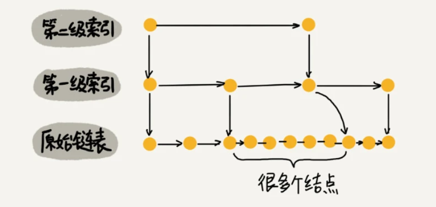

##特性

1. 跳表：链表加多级索引的结构，就是跳表。
2. 链表之前加一层及以上的索引层，索引层（也类似于一条链表、）每个节点跟链表的节点类似，但多了一个指针down，指向下面的链表节点。
3. 以空间换取时间
4. 实际开发过程中，链表节点往往存放了对象，而索引值存储了几个关键值和几个指针，所以当对象比索引结点大很多时，那索引占用的额外空间就可以忽略了。
5. 相比与链表，跳表的插入与删除也很高效。
6. 注意：跳表索引需要动态更新，不然会让跳表退化成链表。
7. 构建多级索引来提高查询的效率，实现了基于链表的二分查找
8. 跳表是一种动态数据结构，支持快速地插入、删除、查找操作，时间复杂度都是 O(logn)。
9. 

##建立跳表
1. 为一个值有序的链表建立多级索引，比如每2个节点提取一个节点到上一级，我们把抽出来的那一级叫做索引或索引层。其中down表示down指针，指向下一级节点。以此类推，对于节点数为n的链表，大约可以建立log2n-1级索引。